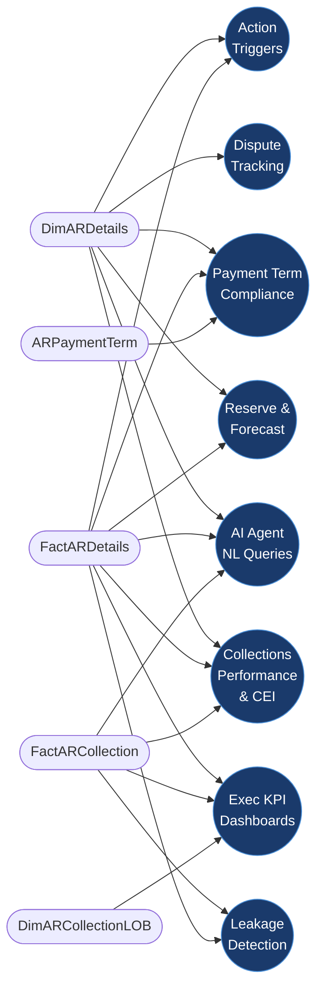
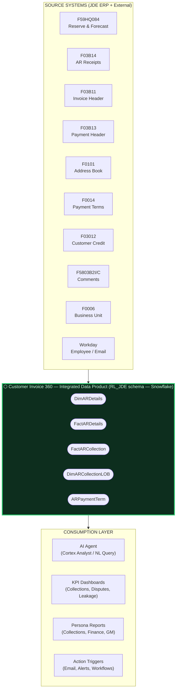
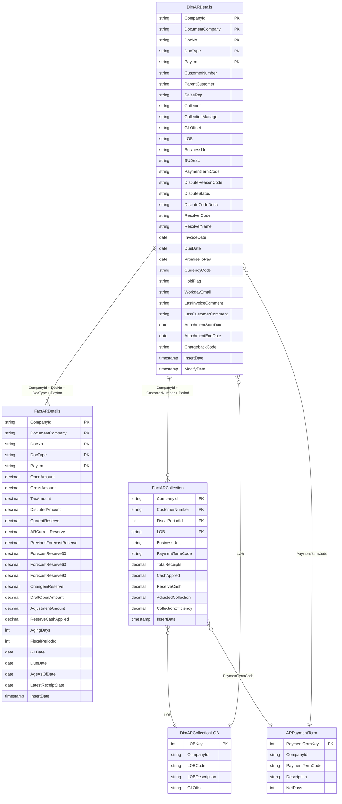
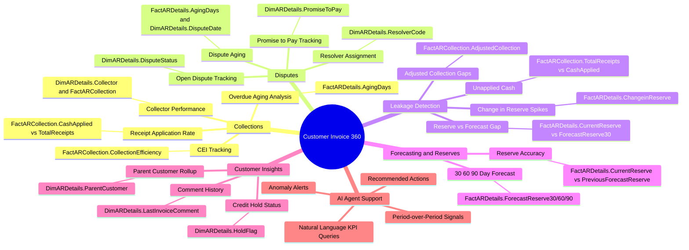
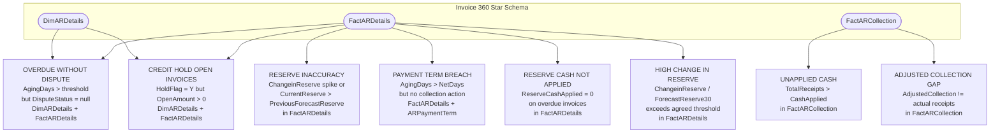
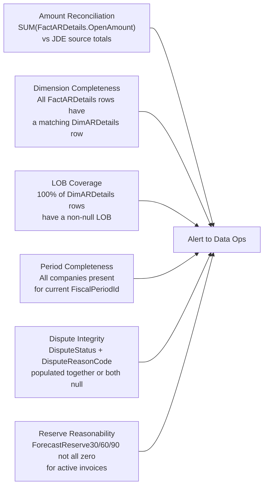
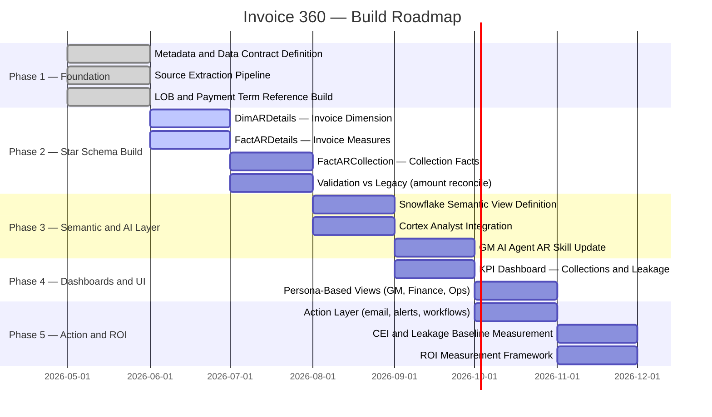

# Customer Invoice 360 — Intermediate Data Product (IDP)
### Design Document & Architecture Blueprint

> **Version:** 2.0 — Design Session Reference  
> **Date:** May 2026  
> **Audience:** Data Engineering, Data Modelling, AI/Analytics, Business Stakeholders  
> **Status:** Draft — For Review

---

## Table of Contents

1. [What is Customer Invoice 360?](#1-what-is-invoice-360)
2. [Source → IDP → Use Cases — Finished Product View](#2-source--idp--use-cases--finished-product-view)
3. [Strategic Context](#3-strategic-context)
4. [High-Level Architecture](#4-high-level-architecture)
5. [Star Schema — Final Consumption Tables](#5-star-schema--final-consumption-tables)
6. [Use Cases Served](#6-use-cases-served)
7. [Collection Leakage — Key Problem Areas](#7-collection-leakage--key-problem-areas)
8. [AI & Analytics Consumption Layer](#8-ai--analytics-consumption-layer)
9. [Data Governance & Metadata Contract](#9-data-governance--metadata-contract)
10. [Roadmap Phases](#10-roadmap-phases)
11. [Open Design Decisions](#11-open-design-decisions)

---

## 1. What is Invoice 360?

Invoice 360 is the **central Integrated Data Product (IDP)** for the Accounts Receivable domain. It consolidates fragmented, script-heavy pipelines from JDE ERP into a **standardised star-schema** — a single source of truth that serves every AR initiative without each team building their own data layer.

**The product delivers 5 final tables** that any consumer — dashboard, AI agent, or report — queries directly:

| Table | Type | What it answers |
|---|---|---|
| `DimARDetails` | Dimension | Who, what, where for every invoice — customer, collector, LOB, dispute status, dates |
| `FactARDetails` | Fact | How much — open amount, reserve, forecast (30/60/90 days), aging |
| `FactARCollection` | Fact | How collected — receipts, cash applied, collection efficiency per customer/period |
| `DimARCollectionLOB` | Reference Dim | Line of Business classification lookup |
| `ARPaymentTerm` | Reference Dim | Payment term codes and net-day definitions |

**Invoice grain** — every fact record is at the **invoice / pay-item level**, making it composable across all downstream use cases without re-aggregation risk.

---

## 2. Source → IDP → Use Cases — Finished Product View

> What Invoice 360 looks like as a finished product — where data comes from, what the IDP produces, and which business use cases it enables. Use this as the anchor for design sessions.

### 2.1 End-to-End Lineage — One View


---

### 2.2 Source, IDP and Use Cases — Block & Bubble View

```mermaid
flowchart LR
    subgraph SRC_BOX["SOURCE BLOCKS"]
        direction TB
        SRC_A["JDE ERP Tables\n──────────────────────\nF59HQ084  Reserve & Forecast\nF03B14    AR Receipts\nF03B11    Invoice Header\nF03B13    Payment Header\nF0101     Address Book\nF0014     Payment Terms\nF03012    Customer Credit\nF5803B2x  Comments\nF0006     Business Unit"]
        SRC_B["External\n──────────────────────\nWorkday\n(Employee / Email)"]
    end

    subgraph IDP_BOX["  ⬡  INVOICE 360 — IDP  "]
        direction TB
        IDP1(["DimARDetails\n─────────────────\nAll invoice attributes\nCustomer, Collector\nLOB, BU, Dates\nDispute status, Email\nHold flag, Comments"])
        IDP2(["FactARDetails\n─────────────────\nOpen & Gross amount\nCurrent Reserve\nForecast 30/60/90\nAging days\nDue & GL dates"])
        IDP3(["FactARCollection\n─────────────────\nReceipts by customer\nCash applied\nCollection efficiency\nLOB, Payment term\nFiscal period"])
        IDP4(["DimARCollectionLOB\n─────────────────\nLOB code & description\nGL Offset mapping"])
        IDP5(["ARPaymentTerm\n─────────────────\nPayment term code\nDescription, Net days"])
    end

    subgraph UC_BOX["USE CASE BUBBLES"]
        direction TB
        UC1(("Collections\nEfficiency\n& CEI"))
        UC2(("Reserve vs\nForecast"))
        UC3(("Dispute\nManagement"))
        UC4(("Leakage\nDetection"))
        UC5(("Payment\nCompliance"))
        UC6(("AI\nAgent"))
        UC7(("KPI\nDashboards"))
        UC8(("Action\nAlerts"))
    end

    SRC_BOX --> IDP_BOX
    IDP_BOX --> UC_BOX

    style SRC_BOX  fill:#0d2137,color:#cce4ff,stroke:#4a90d9,stroke-width:2px
    style IDP_BOX  fill:#0d2e1e,color:#ccffe0,stroke:#2ecc71,stroke-width:3px
    style UC_BOX   fill:#2a0d2e,color:#f0ccff,stroke:#9b59b6,stroke-width:2px
```



---

### 2.3 Use Case to Table Traceability



---

## 3. Strategic Context

```
FROM                                          →        TO
──────────────────────────────────────────────────────────────────────────────
Fragmented scripts (~14+ per run)                  4 consolidated pipeline scripts
No single source of truth for AR                   Invoice 360 IDP — one place for all AR data
Manual KPI reporting                               Automated KPI + signal framework
No collection leakage detection                    Structured leakage signals on star schema
Siloed dashboards per team                         Single data product, multi-persona UI
No AI consumption layer                            Cortex Analyst / AI Agent ready (semantic view)
```

### Value Levers

| Lever | Target |
|---|---|
| Development speed | 50–70% faster (shared data product, no re-building per initiative) |
| Collection efficiency | Measurable CEI improvement tracked in `FactARCollection` |
| Leakage reduction | Identified and quantified at invoice level in `FactARDetails` |
| Dispute resolution | Faster turn-around via dispute attributes in `DimARDetails` + action triggers |
| Forecast accuracy | Reserve vs actual gap surfaced via `FactARDetails` forecast fields |

---

## 4. High-Level Architecture



### Source to Final Table Lineage

| JDE Source | Fields Contributed | Lands In |
|---|---|---|
| `F59HQ084` — Reserve & Forecast | Reserve amounts, forecast buckets (30/60/90), aging, period | `FactARDetails` |
| `F03B14` — AR Receipts | Cash receipts, GL offset, BU, receipt date | `FactARCollection` |
| `F03B11` — Invoice Header | Open amount, gross amount, due date, GL date, pay item | `DimARDetails`, `FactARDetails` |
| `F03B13` — Payment Header | Payment matching, receipt reference | `FactARCollection` |
| `F0101` — Address Book | Sales rep, collector, parent customer | `DimARDetails` |
| `F0014` — Payment Terms | Term code, net days, description | `ARPaymentTerm` |
| `F03012` — Customer Credit | Credit hold flag, AR code | `DimARDetails` |
| `F5803B2I/C` — Comments | Latest invoice comment, latest customer comment | `DimARDetails` |
| `F0006` — Business Unit | BU description, BU hierarchy | `DimARDetails`, `FactARCollection` |
| `F0012` — GL Offset | LOB classification via offset code | `DimARCollectionLOB` |
| `Workday` — Employee | Collector / sales rep work email | `DimARDetails` |

---

## 5. Star Schema — Final Consumption Tables

> These are the **only 5 tables** that matter for consumers. Everything else is pipeline mechanics.

### 5.1 Star Schema Diagram



---

### 5.2 Table Descriptions

#### `DimARDetails` — The Invoice Dimension
The descriptive backbone of Invoice 360. One row per invoice / pay-item. Holds everything needed to **describe** an invoice — who owns it, what status it is in, what LOB it belongs to, whether it is disputed, whether the customer is on hold, and the latest collection comment.

**Key fields:** `CustomerNumber`, `ParentCustomer`, `Collector`, `CollectionManager`, `LOB`, `DisputeStatus`, `DisputeReasonCode`, `ResolverCode`, `HoldFlag`, `WorkdayEmail`, `LastInvoiceComment`, `DueDate`, `AttachmentStartDate`

---

#### `FactARDetails` — The Invoice Measures
All quantitative measures per invoice / pay-item. The **numbers** that drive every KPI — how much is open, how much is reserved, what the forecast says, how many days overdue.

**Key fields:** `OpenAmount`, `CurrentReserve`, `ForecastReserve30/60/90`, `ChangeinReserve`, `AgingDays`, `ReserveCashApplied`, `DisputedAmount`, `DraftOpenAmount`, `FiscalPeriodId`

---

#### `FactARCollection` — The Collection Facts
Aggregated collection performance per customer, LOB, and fiscal period. The **collection efficiency story** — what was received, how much was applied, how efficient was the collection process.

**Key fields:** `TotalReceipts`, `CashApplied`, `ReserveCash`, `AdjustedCollection`, `CollectionEfficiency`, `FiscalPeriodId`, `LOB`, `PaymentTermCode`

---

#### `DimARCollectionLOB` — Line of Business Reference
Maps GL Offset codes to Line of Business labels. Used to classify invoices and collection records by business line across all fact tables.

**Key fields:** `LOBCode`, `LOBDescription`, `GLOffset`

---

#### `ARPaymentTerm` — Payment Term Reference
Defines the payment terms used across invoices and collection records. Used to assess payment term compliance and overdue classification.

**Key fields:** `PaymentTermCode`, `Description`, `NetDays`

---

## 6. Use Cases Served



### Use Case to Table Mapping

| Use Case | Primary Tables | Key Fields |
|---|---|---|
| CEI — Collection Efficiency | `FactARCollection` | `CashApplied`, `TotalReceipts`, `CollectionEfficiency` |
| Collector Performance | `DimARDetails` + `FactARCollection` | `Collector`, `TotalReceipts` by collector |
| Aging & Overdue Analysis | `FactARDetails` + `DimARDetails` | `AgingDays`, `DueDate`, `OpenAmount` |
| Reserve vs Forecast | `FactARDetails` | `CurrentReserve`, `ForecastReserve30/60/90`, `ChangeinReserve` |
| Dispute Tracking | `DimARDetails` | `DisputeStatus`, `DisputeReasonCode`, `ResolverCode`, `PromiseToPay` |
| Collection Leakage | `FactARDetails` + `FactARCollection` | `ChangeinReserve`, `AdjustedCollection`, `ReserveCashApplied` |
| Payment Term Compliance | `DimARDetails` + `ARPaymentTerm` + `FactARDetails` | `PaymentTermCode`, `NetDays`, `DueDate`, `AgingDays` |
| LOB Performance | `FactARCollection` + `DimARCollectionLOB` | `LOB`, `CollectionEfficiency` by LOB |
| Executive KPI Summary | `FactARDetails` + `FactARCollection` | Aggregated by `FiscalPeriodId`, `CompanyId` |
| AI Agent NL Queries | `DimARDetails` + `FactARDetails` + `FactARCollection` | All fields via semantic view |

---

## 7. Collection Leakage — Key Problem Areas

Based on the collection leakage review, the following areas represent **value-at-risk** that Invoice 360 surfaces directly from the star schema.

### 7.1 Leakage Signals — Resolved from Star Schema



### 7.2 Leakage KPIs

| KPI | Table | Formula |
|---|---|---|
| Unapplied Cash % | `FactARCollection` | `1 - (CashApplied / TotalReceipts)` |
| Reserve Accuracy % | `FactARDetails` | `1 - ABS(ChangeinReserve / ForecastReserve30)` |
| Collection Efficiency Index (CEI) | `FactARCollection` | `CashApplied / (OpenAmount + TotalReceipts)` |
| Dispute Resolution Rate | `DimARDetails` | `COUNT(DisputeStatus='Resolved') / COUNT(DisputeStatus IS NOT NULL)` |
| Overdue Without Action % | `DimARDetails` + `FactARDetails` | `COUNT(AgingDays > 30 AND DisputeStatus IS NULL) / COUNT(AgingDays > 30)` |
| Reserve Cash Coverage | `FactARDetails` | `ReserveCashApplied / CurrentReserve` |
| High Reserve Change Invoices | `FactARDetails` | `COUNT(ChangeinReserve / ForecastReserve30 > 0.2)` |

---

## 8. AI & Analytics Consumption Layer

```mermaid
flowchart LR
    subgraph IDP["Invoice 360 Star Schema"]
        DIM(["DimARDetails"])
        FACT1(["FactARDetails"])
        FACT2(["FactARCollection"])
        LOB(["DimARCollectionLOB"])
        PT(["ARPaymentTerm"])
    end

    subgraph SEMANTIC["Semantic / AI Layer"]
        SV["Snowflake Semantic View\n(KPI definitions, joins pre-defined\nsynonyms for NL queries)"]
        CA["Cortex Analyst\n(Text-to-SQL)"]
        CS["Cortex Search\n(Playbook, leakage notes\nbusiness definitions)"]
    end

    subgraph PERSONA["Persona-Based Consumption"]
        P1["Collections Manager\n→ CEI, Aging, Collector performance\n→ Action: Email / Escalate"]
        P2["Finance / Reporting\n→ Reserve accuracy, Forecast gap\n→ Action: Adjust reserve"]
        P3["GM / Executive\n→ Summary KPIs, Trend view\n→ Action: Approve write-off"]
        P4["Dispute Resolver\n→ Open disputes by age & LOB\n→ Action: Resolve / Escalate"]
    end

    subgraph ACTIONS["Action Layer"]
        A1["Email Trigger\n(overdue + no collection activity)"]
        A2["Alert Push\n(leakage threshold breach)"]
        A3["Workflow Initiation\n(dispute > 30 days unresolved)"]
    end

    IDP --> SV --> CA
    CS --> CA
    CA --> PERSONA
    PERSONA --> ACTIONS
```



### Sample AI Agent Queries → Table Mapping

| User Question | Tables Queried | Output |
|---|---|---|
| "What is our CEI for this month?" | `FactARCollection` | CEI % by period |
| "Which customers have overdue invoices with no dispute?" | `DimARDetails` + `FactARDetails` | Customer list + open amounts |
| "Show reserve vs forecast gap for LOB Maintenance" | `FactARDetails` + `DimARCollectionLOB` | `ChangeinReserve` by LOB |
| "Who are the top 10 collectors by cash collected?" | `FactARCollection` + `DimARDetails` | Collector performance ranking |
| "Which invoices are breaching payment terms?" | `FactARDetails` + `DimARDetails` + `ARPaymentTerm` | Invoices with `AgingDays > NetDays` |
| "Which invoices are at risk of write-off?" | `FactARDetails` + `DimARDetails` | High aging + no reserve coverage |
| "Show collection efficiency by LOB this quarter" | `FactARCollection` + `DimARCollectionLOB` | `CollectionEfficiency` by LOB |

---

## 9. Data Governance & Metadata Contract

### 9.1 Metadata Contract

| Attribute | Definition |
|---|---|
| **Grain** | Invoice / Pay-item level — `CompanyId + DocumentCompany + DocNo + DocType + PayItm` |
| **Primary Key** | Same as grain |
| **Currency** | As-reported in source JDE, `CurrencyCode` column always present |
| **Amounts** | All monetary values are decimal — precision-adjusted from JDE integer encoding |
| **Dates** | All JDE Julian dates converted to `DATE` or `TIMESTAMP` |
| **Period Key** | `FiscalPeriodId = ((Century * 100 + Year) * 100) + Month` |
| **LOB derivation** | GL Offset code → `DimARCollectionLOB.GLOffset` → LOB label |
| **Schema** | All final tables reside in `RL_JDE` schema on Snowflake |

### 9.2 Data Quality Checks



### 9.3 Naming Conventions

| Prefix | Purpose | Examples |
|---|---|---|
| `pl_jde.*` | Raw JDE source (read-only) | `F59HQ084`, `F03B14`, `F03B11` |
| `Dim*` | Dimension tables (final) | `DimARDetails`, `DimARCollectionLOB` |
| `Fact*` | Fact tables (final) | `FactARDetails`, `FactARCollection` |
| `AR*` | AR-specific reference dims | `ARPaymentTerm` |
| `Config*` | Pipeline config & lookup | `configlkpjdeprecision`, `ConfigARLOGGEDCASHBU` |

---

## 10. Roadmap Phases



---

## 11. Open Design Decisions

| # | Decision | Options | Recommendation | Owner |
|---|---|---|---|---|
| D1 | **Workday email integration** | Live SQL Server call vs pre-loaded reference table | Reference table (scheduled refresh) — decouples pipeline from external DB | Data Eng |
| D2 | **CEI definition** | Industry standard vs Otis-adjusted | Define in metadata contract with Finance sign-off | Finance / Business |
| D3 | **Currency handling** | Local currency only vs USD-normalised column | Both — local for operational view, USD for exec summaries | Finance |
| D4 | **Leakage signal delivery** | Computed fields in `FactARDetails` vs separate leakage table | Computed fields first, separate table once thresholds agreed | Analytics |
| D5 | **Incremental vs full refresh** | Full refresh daily vs MERGE-based incremental | MERGE incremental — extend to all final tables | Data Eng |
| D6 | **Semantic view grain** | Invoice-level view vs customer-period aggregated view | Both — dual views covering different query patterns | AI / Analytics |
| D7 | **France-specific logic (co. 10168)** | Python branching vs SQL CASE in pipeline | SQL CASE — keeps logic in-query, traceable | Data Modeller |
| D8 | **DimARDetails dispute fields** | Embed dispute in dimension vs separate `DimARDispute` | Embed in `DimARDetails` for single-table invoice queries | Data Modeller |

---

## Appendix — Source to Final Table Lineage

```
JDE F59HQ084  (Reserve & Forecast)
    └──► FactARDetails
             CurrentReserve, ARCurrentReserve, PreviousForecastReserve
             ForecastReserve30 / 60 / 90, ChangeinReserve, DraftOpenAmount
             AgeAsOfDate, FiscalPeriodId

JDE F03B14  (AR Receipts)
    └──► FactARCollection
             TotalReceipts, CashApplied, ReserveCash, AdjustedCollection

JDE F03B11  (Invoice Header)
    └──► DimARDetails
             InvoiceDate, DueDate, CurrencyCode, PaymentTermCode, GLOffset
    └──► FactARDetails
             OpenAmount, GrossAmount, TaxAmount, AgingDays, GLDate, DueDate

JDE F03B13  (Payment Header)
    └──► FactARCollection
             Payment matching / receipt reference

JDE F0101  (Address Book)
    └──► DimARDetails
             SalesRep, Collector, ParentCustomer

JDE F0014  (Payment Terms)
    └──► ARPaymentTerm
             PaymentTermCode, Description, NetDays

JDE F03012  (Customer Credit)
    └──► DimARDetails
             HoldFlag, ARCode

JDE F5803B2I/C  (Invoice & Customer Comments)
    └──► DimARDetails
             LastInvoiceComment, LastCustomerComment

JDE F0006  (Business Unit)
    └──► DimARDetails
             BusinessUnit, BUDesc
    └──► FactARCollection
             BusinessUnit

JDE F0012  (GL Offset descriptions)
    └──► DimARCollectionLOB
             LOBCode, LOBDescription, GLOffset
    └──► DimARDetails
             LOB (via DimARCollectionLOB)

Workday  (Employee / Email)
    └──► DimARDetails
             WorkdayEmail  (matched via F01151 email)
```

---

*Document prepared for Invoice 360 Design Session — May 2026*  
*Based on: C2C_efforts.md roadmap, collection leakage analysis, AR pipeline scripts*
